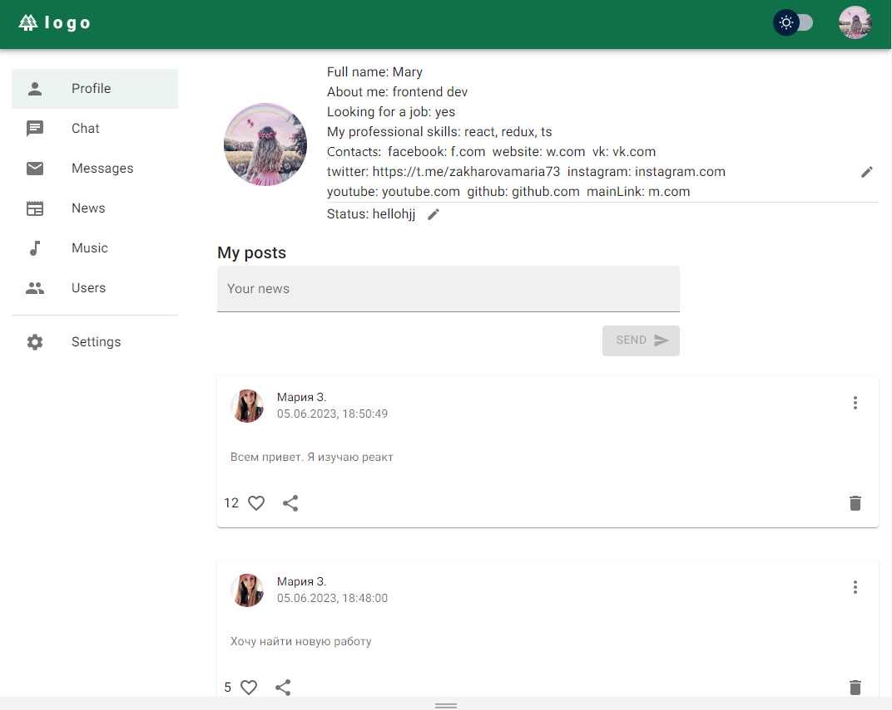

### Social network

#### О проекте

Социальная сеть. Пользователь может авторизоваться, видеть список других пользователей, фильтровать список, искать пользователя по имени, отправить сообщение в общий чат, видеть сообщения других пользователей, подписываться/отписываться, изменить информацию о себе, аватар. Также реализована возможность смены темы, языка (i18next), валидация форм (formik, yup), пагинация. Написаны тесты для некоторых редьюсеров и санок.

Данные для входа:
email: free@samuraijs.com, password: free

<!-- lukoyanowa.maria@yandex.ru maria7373 -->

#### Технологии

  
  
  
  
  
  
  
  
  

#### Установка и запуск приложения

<b>Развернуть</b>

Клонировать репозиторий:

    git clone https://github.com/Mariyazakharova73/social-network-v2.git

Установить зависимости:

    npm install

Собрать проект:

    npm run build

Запустить проект:

    npm start

[Ссылка на проект Social network](https://mariyazakharova73.github.io/social-network-v2/)

  

